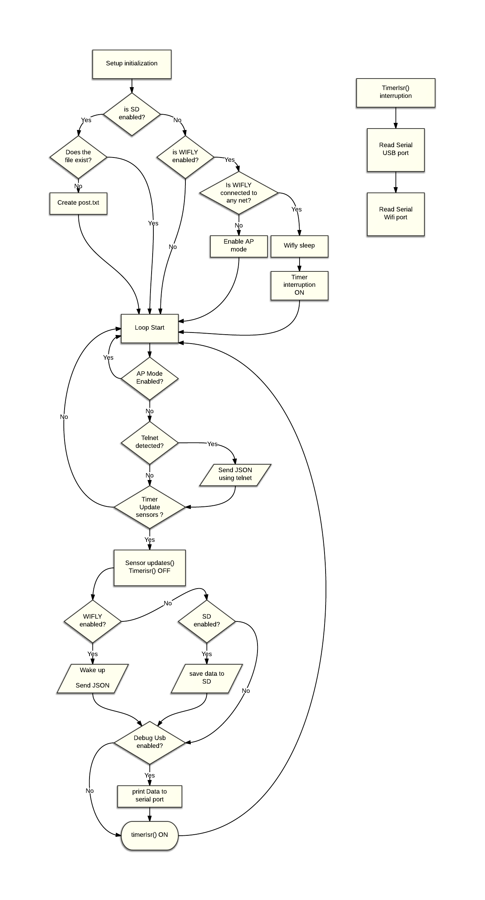

# Hardware

## Components

Now all the pieces that the SCK consists of will be described. Along each product a link will be attached which redirects to their datasheet.

## Core components
### RTC Clock
The core board utilises a crystal oscillator that acts as a 16MHz real time clock. It needs an external power source to ensure it is always working and that is why you need to place a button cell in the bottom part of the core board.

### Atmel Mega 32U4-AU
As for the central processing unit the SCK uses an AVR chip from Atmel, as the Arduino Leonardo does. This is a low power, high performance 8-bit microcontroller, which at the same time has USB built-in capabilities, which allows oprating systems to recognise it as a regular mouse.

### Panel
TBD.

## Ambient shield components
This shield measures, as its name indicates, environmental factors. More precisely: temperature, humidity, CO, NO2, light and noise.

### Temperature and humidity
This two measurements are obtained thanks to the [*DHT22 sensor*](http://dlnmh9ip6v2uc.cloudfront.net/datasheets/Sensors/Weather/RHT03.pdf), manufactured by Aosong Electronics, a Chinese corporation. They are quite cheap (you can obtain it for around $12USD) and are very precise. The output is not in analogic form but in digital form, meaning that the signal is in the either ones or zeros, thus requiring some extra "intelligence" to interpret the results.

The necessary libraries are already implemented to use along with Arduino and can be found in [GitHub](https://github.com/nethoncho/Arduino-DHT22). They were initially developed by Ben Adams in 2011 and implements a non-standard single wire protocol, necessary to establish a successful connection between Arduino and the sensor.

In the SCK code, you'll be able to find this library inside the `SmartCitizenAmbient.cpp` and `SmartCitizenAmbient.h` files. More precisely, you shall find a function named `DHT22`.

### CO
Carbon monoxide levels are measured through the [*MiCS 5525 sensor*](http://www.e2v.com/e2v/assets/File/sensors_datasheets/metal_oxide/MICS-5525.pdf), a sensor made by e2v. This time the output is not digital but analogic. That means the sensing resistance decreases when CO is around. The main structure of this sensor consists on a heating resistor and the previously mentioned sensing layer.

When it comes to the code there are three main functions that help obtaining the actual CO level, which are `getMICS` (which gets the actual reading), `VH_MICS` and `readVH` (sets the heating voltage and reads its value respectively), and `RL_MICS` (sets the value of RL not to damage the sensing layer) also found inside the files that does everything for the ambient shield (`SmartCitizenAmbient.cpp` and `SmartCitizenAmbient.h`).

### NO2
Nitrogen dioxide is measured buy another e2v sensor. In detail we are talking about the [*MiCS 2710*](http://www.e2v.com/e2v/assets/File/sensors_datasheets/metal_oxide/MICS-2710.pdf), a small, low power and precise NO2 sensor.

Luckily, we can use the same functions implemented for the previous e2v sensors so there is no need to explain what they do again.

### Light and noise
To quantify light and noise levels we used a LDR (light dependant resitor) and a microphone. The market is highly saturated with this kind of components, but for the sake of this project we chose the following ones:
- LDR: [*Excelitas Tech VT935G*](http://www.farnell.com/datasheets/1475763.pdf)
- Microphone: [*Pro Signal ABM-705-RC*](http://www.farnell.com/datasheets/1671459.pdf)

### 2.4GHz ISM spectrum
Although this is measured using the core component [WiFly](https://www.sparkfun.com/datasheets/Wireless/WiFi/rn-131-ds.pdf), it is an environmental factor as well. With a Wi-Fi enabled component we can check how many SSIDs are transmitting at one given time thus giving an approximate idea on how saturated is this band of the spectrum.

## Firmware
The main firmware file called is the `*.ino` file you'll find in our [github repository](https://github.com/fablabbcn/Smart-Citizen-Kit). An overview on how it works can be seen on the next picture:

