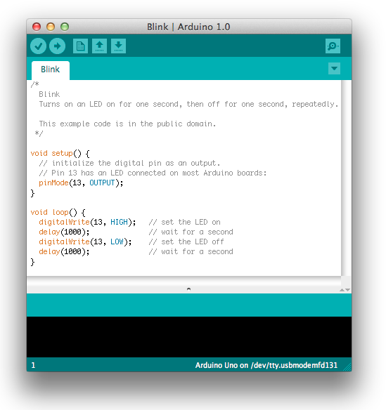
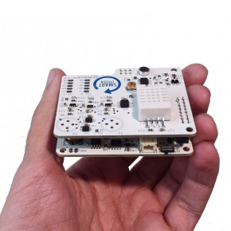

# Tutorials

## Getting Started

### Download and install Arduino IDE
The first step to use and configure a SCK is getting the *Arduino IDE*, which is nothing more than the program you use to upload a program (also called sketch) to an Arduino board. You can [download](http://arduino.cc/en/Main/Software) the appropiate binaries for your operating system from the official website of Arduino, or, if you like bleeding-edge technology you can compile it from source by downloading the latest version of the code in [Google Code](https://code.google.com/p/arduino) (instructions on how to compile source can be found [here](https://code.google.com/p/arduino/wiki/BuildingArduino)). Install drivers if necessary and get the system up and running, as described in the [official website](http://arduino.cc/en/Guide/HomePage) (choose your OS). The SCK core is a modified Arduino Leonardo, thus you have to select it in the Arduino IDE as follows: *Tools>>Board>>Arduino Leonardo*. Now you should be able to run the application and get a similar window to this following one:

### Uploading the firmware to the board
Now it's time to grab the SmartCitizen firmware from our repository in [GitHub](https://github.com/fablabbcn/Smart-Citizen-Kit). There are two ways to do this:

- Press the button that says *ZIP* in GitHub so you can download a zipped version of the entire repository.
- If you have Git installed in your machine you can just type the following in your terminal: `git clone git://github.com/fablabbcn/Smart-Citizen-Kit.git`

Next open the main file, `Sck_*.ino`, with the previously downloaded IDE and press `CTRL+U`, which will upload the program to the board.

### Configuring the SCK
Now you the board knows what to do but it also has to be able to upload all gathered information to the Internet, thus you need to configure your network. You can easily do this inside the very own platform. Enter the appropriate [section](http://#) and select the ESSID, its password, the encryption scheme it uses (WEP, WPA or WPA2) and the kind of antenna the SCK will be using. The applet will do the rest for you.

On the other hand there are two alternative methods if the applet doesn't work in your system or you want to "go a little deeper". Via *telnet* or by executing a python script, also located in [our repository](https://github.com/fablabbcn/Smart-Citizen-Kit). The script features a wizard-like form that will help you through the process of configuring your board. That means you can even configure the SCK from your smartphone if you have the privileges and the right app to execute an external scripts.

### Start sharing
Head to the [Smart Citizen website](http://smartcitizen.me), create an account and register your SCK along with its unique ID (MAC address). You're ready to go now. And remember, sharing is caring.

